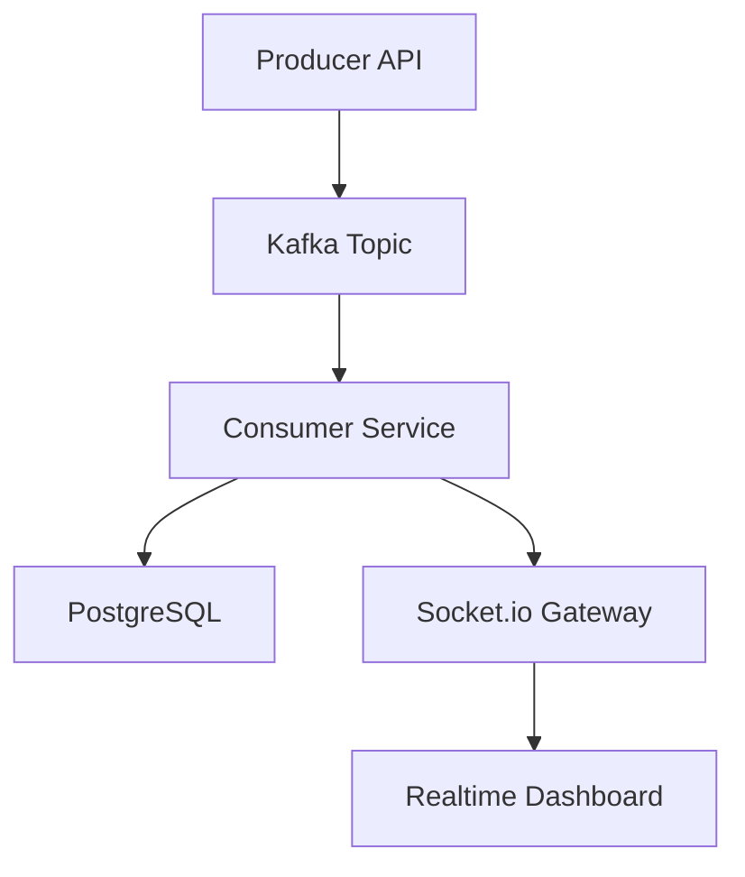

# ZenFlow — Real-Time Event Processing Platform

ZenFlow is a real-time event-driven analytics and observability platform inspired by enterprise-grade distributed systems.

It demonstrates:

* Apache Kafka streaming
* Real-time analytics dashboards
* WebSocket synchronization
* Distributed producer-consumer architecture
* PostgreSQL persistence
* Dockerized infrastructure

---

## Features

* Real-time event ingestion
* Kafka-based event streaming
* Live analytics dashboard
* WebSocket updates
* PostgreSQL persistence layer
* Docker Compose infrastructure
* Enterprise dark-theme UI
* System metrics monitoring
* Distributed architecture simulation

---

## Tech Stack

### Frontend

* React
* TypeScript
* Tailwind CSS
* Recharts
* Socket.io Client

### Backend

* Node.js
* Express
* KafkaJS
* Socket.io

### Infrastructure

* Apache Kafka
* Zookeeper
* PostgreSQL
* Docker Compose

---

## Architecture



---

## System Dashboard

Features include:

* Live event stream
* Event throughput charts
* System metrics
* Service health monitoring
* Real-time WebSocket updates

---

## Local Setup

### Start Infrastructure

```bash
docker-compose up -d
```

### Install Dependencies

```bash
npm install
```

### Start Development Server

```bash
npm run dev
```

---

## API Endpoints

### Health Check

```http
GET /api/health
```

### Produce Event

```http
POST /api/events
```

### Simulate Traffic

```http
POST /api/simulate
```

---

## Future Improvements

* Dead Letter Queue
* Retry Mechanisms
* Redis Caching
* Kubernetes Deployment
* Prometheus Metrics
* Distributed Consumers

---

## Author

Built by Sahil Das
